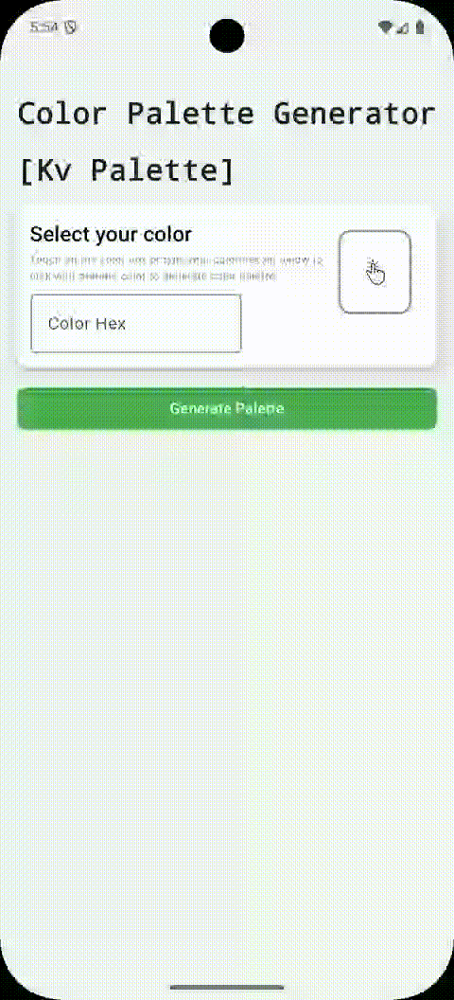

# KvColorPicker - Android

[](https://jitpack.io/#KvColorPalette/KvColorPicker-Android)

This is a lightweight Android library that provides Jetpack Compose `@Composable` UI to select colors. This open as a bottom sheet in default. 
But developers can use individual peaces available in the library as per their requirements.

# Features
* Color Picker BottomSheet
* Pick color from RGB-A values
* Pick color from Predefined color grid
* Pick color from HSL-A values (Color spectrum)

# Reference App
To show case all features and functionalities of this library, there is a reference app we build. Application is already available in Google Play Store. Reference app code is available in GitHub.
|Title                  |Link                                                                           |
|-----------------------|-------------------------------------------------------------------------------|
|Google Play Store      |https://play.google.com/store/apps/details?id=com.kavi.droid.color.palette.app |
|GitHub Code Reference  |https://github.com/KvColorPalette/KvColorPalette-Android-App                   |

# Installation
Add following in your root `build.gradle`/`build.gradle.kts` at the end of repositories:
````
dependencyResolutionManagement {
	repositories {
		mavenCentral()
		maven { url 'https://jitpack.io' } // jitpack.io repository configured.
	}
}
````

Add the following dependency to your `build.gradle` / `build.gradle.kts` file:
For Groovy - `build.gradle`:
````
dependencies {
    implementation 'com.github.KvColorPalette:KvColorPicker-Android:2.1.0'
}
````
For Kotlin DSL - `build.gradle.kts`:
````
dependencies {
    implementation("com.github.KvColorPalette:KvColorPicker-Android:2.1.0")
}
````

# Usage
After you integrated the `KvColorPicker-Android` library, you can consume it as follows.

### Open up BottomSheet
As a main functionality, consumer can use color picker bottom sheet in there application as follows.
```
// Create state variable to show and hide bottom sheet
val showSheet = remember { mutableStateOf(false) }
val sheetState = rememberModalBottomSheetState(skipPartiallyExpanded = true)

// Button click to open bottom-sheet
Button(
    onClick = {
        sheetState.value = true
    }
) {
    Text("Open Color Picker")
}

// Color Picker bottom sheet UI
if (showSheet.value) {
    KvColorPickerBottomSheet(
        showSheet = showSheet,
        sheetState = sheetState, 
        onColorSelected = { selectedColor -> 
            // Do anything when you have selected color
        }
    )
}
```
#### The way it works
|RGB-A Picker |GRID Picker |HSL-A Picker  |
|-------------|------------|--------------|
|        |    |    |

### Use color picker UI components in existing UI
Developer can add the each color picker (`RGB-A Picker`, `Grid Picker` and `HSL-A Picker`) separately in their own UI. Because `KvColorPicker-Android`
provided.
#### RGB-A Picker
```
RGBAColorPicker(
    modifier = Modifier,
    onColorSelected = { selectedColor ->
        // Action with selected color
    }
)
```
#### GRID Picker
```
GridColorPicker(
    modifier = Modifier,
    onColorSelected = { selectedColor ->
        // Action with selected color
    }
)
```
#### HSL-A Picker
```
HSLAColorPicker(
    modifier = Modifier,
    onColorSelected = { selectedColor ->
        // Action with selected color
    }
)
```

# Contribution
We welcome contributions! Please fork the repository, make your changes, and submit a pull request. Ensure your code adheres to the established guidelines.

# License
`KvColorPicker-Android` is licensed under the [MIT License](https://github.com/KvColorPalette/KvColorPicker-Android/blob/main/LICENSE).

# Feedback
For questions, suggestions, or issues, please open an issue on GitHub or contact us at kavimalw@gmail.com.


